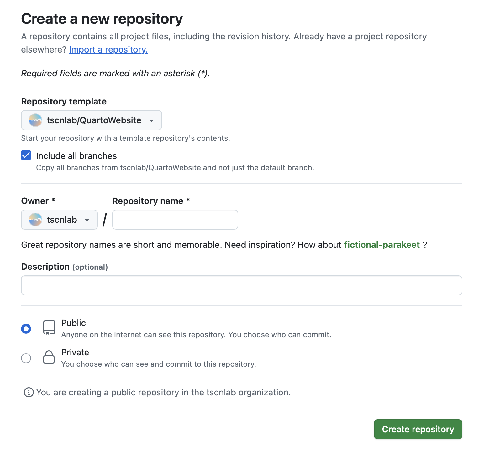

# QuartoWebsite

This repository serves as a template to set up a Quarto website on the TSCN GitHub organization.

In order to set up a new Quarto website, you need to follow these steps:

-   Click on `Use this template` > `Create a new repository` in the top right corner of this page. 
-   Alternatively, you can simple create a new repository in the TSCN GitHub organization and use the template `tscnlab/QuartoWebsite` (see image below)

In both cases:

-   Check the box `Include all branches`
-   Set the repository visibility to `Public` (no site will be published otherwise)
-   Click `Create repository`

**Congratulations - you have created a Website, complete with continuous integration (CI)**

The website will be published at `https://tscnlab.github.io/<REPOSITORY_NAME>/` where `<REPOSITORY_NAME>` is the name of your repository.

If, for some reason, you cannot find the website, you can check the `Actions` tab of your repository. If the CI is running, it will show a green checkmark next to the latest commit. You can also click on the topmost `pages build and deployment`, where there should be a weblink under `deploy`. 

## Cleaning up after the first build

After your site is online, there are a few things you should do:

- In the repo's webpage, go to the cogwheel next to `About`, and check `Use your GitHub Pages website`, then `Save changes`. This will put a handy link to your website in the repo's `About` section.
- You can clone the repository to your local machine to edit the files in the editor of your choice.
- In the file `_quarto.yml`, change the `title` to your liking. You should also set the URL's to the site, repo, and issues, as indicated by the comments.
- In the file `license.md`, change the license type and the terms of the license.
- Add information in the `about.qmd` file. This is the page that will be shown when you click on `About` in the top right corner of the website.
- Add information in the `contributing.qmd` file. This is the page that will be shown when you click on `Contributing` in the top right corner of the website.
- The file `index.qmd` is the main page of the website. You can edit it to your liking.
- To learn more about Quarto websites visit <https://quarto.org/docs/websites>
- lastly, you should remove this README file, as it is only relevant for the template. You should also remove the contents of the `assets` folder, as it is not needed for your website.
